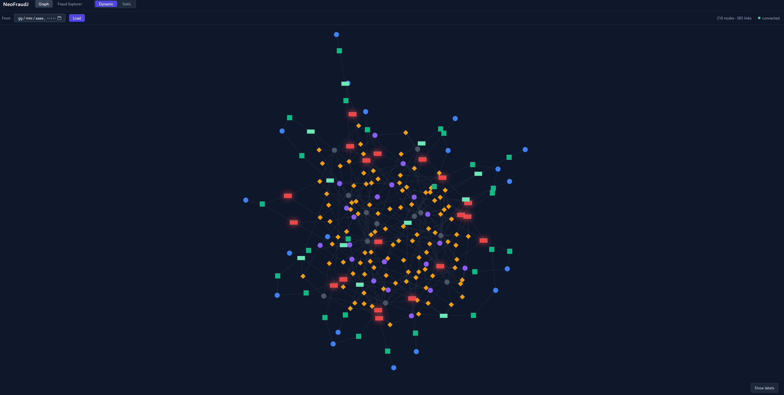
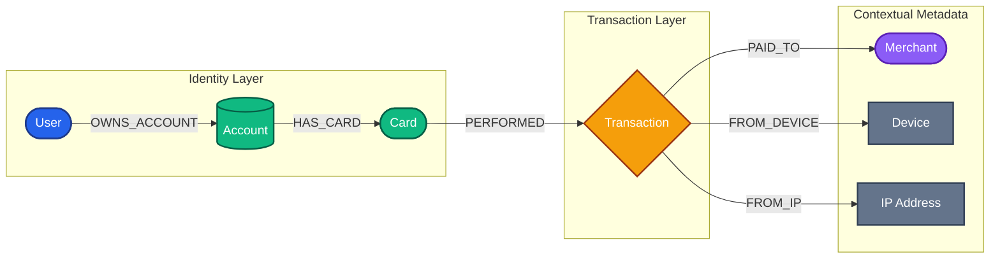
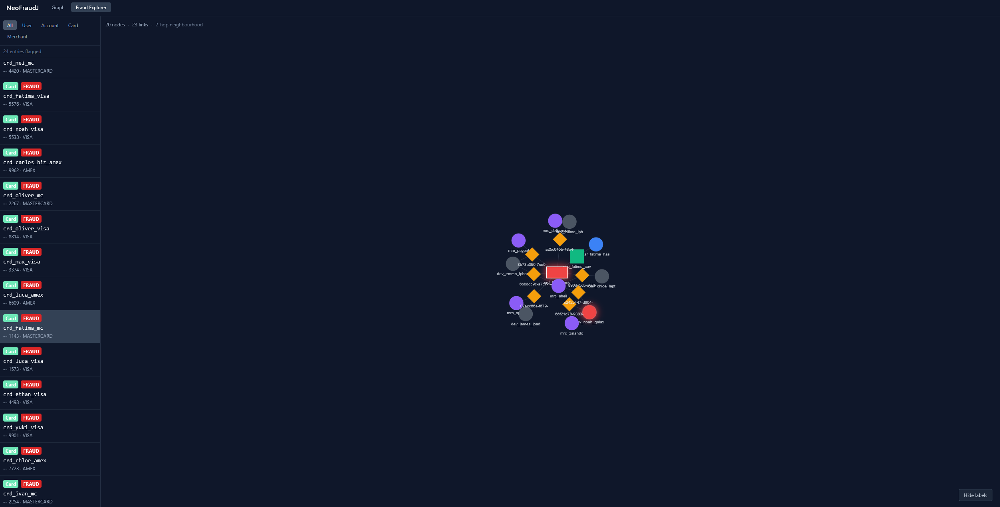
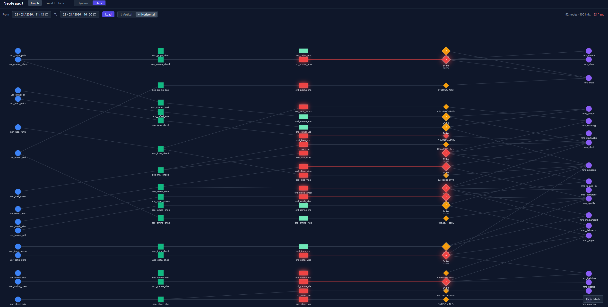

# NeoFraudJ

---



Real-time fraud detection with a live graph dashboard. Transactions flow through a REST API, are persisted as a property graph in Neo4j, and are visualised and analysed in a React UI powered by WebSockets.

---

## Architecture

```
POST /v1/transactions
        |
        v
 ingestion-service (8001)   Validates payload, publishes to Redis Stream
        |
        | Redis Stream: neofraudj:transactions
        v
 processor-service          Consumes stream, writes full graph to Neo4j
        |
        v
      Neo4j                 Property graph database
        ^
        |
 detection-service (8002)   Fraud detection queries, REST graph API, WebSocket broadcaster
        |
        v
      UI (5173)             React dashboard — Dynamic + Static graph views
```

The system is split into independent microservices so that each concern — ingestion, persistence, detection, visualisation — can scale and fail in isolation. Services communicate asynchronously through Redis Streams rather than direct HTTP calls, which means the ingestion endpoint never blocks waiting for Neo4j.

### ingestion-service

The public-facing entry point. It accepts `POST /v1/transactions`, validates the payload with Pydantic, and immediately publishes it to the Redis Stream `neofraudj:transactions`. It does not touch Neo4j at all — its job is to accept traffic as fast as possible and hand off the work. Response time is in the single-digit milliseconds.

### processor-service

A background worker that runs a Redis consumer group (`XREADGROUP`). It reads batches of raw transaction messages, resolves the full entity graph (User -> Account -> Card -> Transaction -> Merchant -> Device -> IPAddress), and writes everything to Neo4j using `MERGE` statements so nodes are never duplicated. It also handles dead-letter recovery via `XAUTOCLAIM`.

### detection-service

Serves two roles:

1. **REST API** — exposes `GET /v1/graph` for time-bounded graph snapshots, `GET /v1/alerts` to run all five fraud patterns, and `GET /v1/transactions/{id}/risk-score` for per-transaction scoring.
2. **WebSocket broadcaster** — a background `asyncio` task listens to the same Redis Stream (via `XREAD`, not a consumer group, so it does not interfere with the processor). For each new transaction it runs a velocity check against Neo4j, marks fraudulent nodes (`isFraud = true`) permanently, and broadcasts a `GRAPH_UPDATE` message to every connected WebSocket client. On connection, the server immediately sends the last 100 transactions as a snapshot so the client starts with context.

### UI

A React + TypeScript single-page app served by Vite. It has two graph modes:

- **Dynamic** — connects via WebSocket and renders new transactions in real time using a force-directed simulation (`react-force-graph-2d`). Fraud nodes glow red. Clicking any node highlights its full directed chain and dims the rest.
- **Static** — fetches a time-bounded snapshot via REST and renders a deterministic hierarchical layout computed by `dagre`. Transactions from the same card are collapsed into a single cluster diamond. Supports Vertical (top -> bottom) and Horizontal (left -> right) orientations.

### Redis

Redis Streams are used as the message bus between ingestion and processing. A stream entry is written once (`XADD`) and consumed reliably by the processor via a consumer group with acknowledgement (`XACK`). The detection service taps the same stream in read-only mode (`XREAD`) without joining the consumer group, so it sees every message without affecting the processor's offset. Redis is also the reason the ingestion service has no direct dependency on Neo4j — a Neo4j restart does not cause ingestion to fail.

### Neo4j

The core of the system. The data model is a property graph where every entity (users, accounts, cards, transactions, merchants) is a node and every relationship between them is a typed, directed edge. This structure makes fraud pattern detection natural: a velocity check is a simple count of `PERFORMED` edges from a `Card` within a time window; a geographic anomaly is two hops from `Card` through `Transaction` to `IPAddress` with a time and location filter. Queries that would require several joins in a relational database are single Cypher traversals here. Fraud flags (`isFraud = true`) are written back to the relevant nodes so they persist across restarts and are immediately visible in static graph queries.

---

## Data Model

### Nodes

| Label | Key property | Description |
|---|---|---|
| `User` | `user_id` | Person who owns accounts |
| `Account` | `account_id` | Financial account belonging to a user |
| `Card` | `card_id` | Payment card linked to an account |
| `Transaction` | `transaction_id` | Single payment event |
| `Merchant` | `merchant_id` | Business that received the payment |
| `Device` | `device_id` | Device used to initiate the transaction |
| `IPAddress` | `ip_address` | IP from which the transaction originated |

### Relationships

```
(User)-[:OWNS_ACCOUNT]->(Account)
(Account)-[:HAS_CARD]->(Card)
(Card)-[:PERFORMED]->(Transaction)
(Transaction)-[:PAID_TO]->(Merchant)
(Transaction)-[:FROM_DEVICE]->(Device)
(Transaction)-[:FROM_IP]->(IPAddress)
```

### Schema diagram



---

## Fraud Detection

Five graph-based patterns are evaluated on every ingested transaction:

| Pattern | Logic |
|---|---|
| **Velocity** | Card performs > 5 transactions within 60 s |
| **Device sharing** | Device used by > 3 distinct cards within 24 h |
| **IP sharing** | IP used by > 3 distinct accounts within 1 h |
| **Circular transfer** | Same account pays same merchant > 3x within 24 h |
| **Geographic anomaly** | Same card used from two different IP countries within 10 min |

When velocity fraud is detected the transaction and its card are permanently marked `isFraud = true` in Neo4j so the static graph renders them in red.

### Risk score

`GET /v1/transactions/{id}/risk-score` returns a composite score (0-100):

| Signal | Penalty |
|---|---|
| Velocity (> 5 txns / 60 s) | +40 |
| Device sharing (> 3 cards / 24 h) | +30 |
| IP sharing (> 3 accounts / 1 h) | +20 |

Risk level: HIGH (>= 60) | MEDIUM (>= 30) | LOW (< 30)

---

## Dashboard

Open **http://localhost:5173** after starting the stack.

### Dynamic graph


Connects via WebSocket to `detection-service`. New transactions appear in real time as they are ingested. The server sends a snapshot of the last 100 transactions on connect. Fraud nodes glow red.

- Optional **From** filter: loads history from that point via REST then continues streaming
- Click a node to open the side panel; clicking a **Transaction** node fetches its risk score
- Clicking any node highlights its full chain (upstream to User, downstream to Merchant) and dims everything else



### Static graph



Loads a time-bounded snapshot via `GET /v1/graph?start=...&end=...`. Transaction nodes belonging to the same card are collapsed into a single cluster diamond.

- **Vertical** layout: hierarchy flows top -> bottom (User at top, Merchant at bottom), siblings spread left -> right
- **Horizontal** layout: hierarchy flows left -> right, siblings spread top -> bottom
- Layout is computed with dagre (deterministic, no physics)

---

## API Reference

### Ingestion service — http://localhost:8001

```
POST /v1/transactions        Ingest a transaction (returns 202 Accepted)
GET  /health                 Redis connectivity check
```

### Detection service — http://localhost:8002

```
GET  /v1/graph                            Snapshot: nodes + links (optional ?start= / ?end=)
GET  /v1/alerts                           Run all five fraud patterns
GET  /v1/transactions/{id}/risk-score     Composite risk score for one transaction
GET  /health                              Neo4j connectivity check
WS   /ws                                  Live graph updates
```

Swagger UI: http://localhost:8001/docs · http://localhost:8002/docs

---

## Running locally

**Requirement:** Docker Desktop.

```bash
# 1. Create the environment file
cp .env.example .env

# 2. Build and start everything (includes bulk seeder and stream seeder)
docker compose up -d --build

# 3. Check services are healthy
docker compose ps
```

On first start `bulk-seeder` wipes Neo4j, seeds ~500 transactions with realistic names and injected fraud patterns, then exits. `stream-seeder` starts afterwards and continuously streams new transactions at ~1/sec.

Neo4j Browser: http://localhost:7474 (user: `neo4j`, password from `.env`)

### Useful Cypher queries

```cypher
-- All fraud transactions
MATCH (t:Transaction {isFraud: true}) RETURN t

-- Fraud cards with their transaction count
MATCH (c:Card {isFraud: true})-[:PERFORMED]->(t:Transaction)
RETURN c.card_id, count(t) AS txn_count ORDER BY txn_count DESC
```

---

## Project structure

```
neoFraudJ/
├── docker-compose.yml
├── .env.example
├── Makefile
├── shared/
│   └── models/
│       ├── payloads.py          TransactionPayload — primary data contract
│       └── nodes.py             Typed models for each Neo4j node label
├── ingestion-service/
│   └── app/
│       ├── main.py
│       ├── config.py
│       └── routers/
│           ├── transactions.py
│           └── health.py
├── processor-service/
│   └── app/
│       ├── main.py
│       ├── consumer.py          Redis consumer group (XREADGROUP / XAUTOCLAIM / XACK)
│       └── graph/
│           ├── constraints.py   Neo4j UNIQUE constraints and indexes
│           ├── queries.py       MERGE Cypher for nodes and relationships
│           └── writer.py        Atomic graph writer
├── detection-service/
│   └── app/
│       ├── main.py
│       ├── config.py
│       ├── routers/
│       │   ├── graph_rest.py    GET /v1/graph — time-bounded snapshot
│       │   ├── ws.py            WebSocket broadcaster + Redis listener
│       │   ├── alerts.py
│       │   ├── risk.py
│       │   └── health.py
│       └── services/
│           ├── graph_builder.py Node ID helpers + delta builder
│           ├── fraud_queries.py Cypher fraud detection queries
│           └── detection.py     DetectionService and risk scorer
├── scripts/
│   ├── seed_data.py             Shared user/card/merchant pool
│   ├── bulk_seed.py             One-shot seed with fraud pattern injection
│   └── stream_seed.py           Continuous transaction streamer
└── ui/
    ├── Dockerfile
    ├── package.json
    ├── vite.config.ts
    └── src/
        ├── types/graph.ts       GraphNode, GraphLink, WsMessage, …
        ├── hooks/
        │   ├── useGraphStream.ts   WebSocket + REST history hook
        │   └── useStaticGraph.ts   Static snapshot fetch hook
        ├── utils/
        │   ├── drawNode.ts      Canvas node painter (shape + color + glow)
        │   ├── clusterize.ts    Collapses per-card transaction clusters
        │   └── dagreLayout.ts   Scales dagre positions to fill canvas
        └── components/
            ├── Dashboard.tsx    App shell, mode switcher, dynamic graph
            ├── StaticGraph.tsx  Time-bounded dagre graph
            ├── FraudExplorer.tsx
            └── NodePanel.tsx    Slide-in node detail + risk score fetch
```
